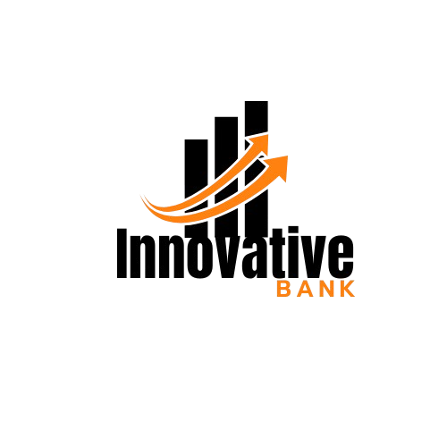

<a name="readme-top">

<br/>

<br />
<div align="center">
  <a href="https://github.com/GodwinAblao">
  <!-- TODO: If you want to add logo or banner you can add it here -->
    
  </a>
<!-- TODO: Change Title to the name of the title of your Project -->
  <h3 align="center">Account Transactions</h3>
</div>
<!-- TODO: Make a short description -->
<div align="center">
  Manage an account with an initial balance of $5000.00, tracking deposits and withdrawals with a complete transaction history.
</div>

<br />

<!-- TODO: Change the zyx-0314 into your github username  -->
<!-- TODO: Change the WD-Template-Project into the same name of your folder -->


[](https://wakatime.com/badge/user/018f0311-e249-4b38-800d-c0a8f9d916d5/project/60a7c2e0-9ab9-413a-ba3f-978da197e63c)

---

<br />
<br />

<!-- TODO: If you want to add more layers for your readme -->
<details>
  <summary>Table of Contents</summary>
  <ol>
    <li>
      <a href="#overview">Overview</a>
      <ol>
        <li>
          <a href="#key-components">Key Components</a>
        </li>
        <li>
          <a href="#technology">Technology</a>
        </li>
      </ol>
    </li>
    <li>
      <a href="#rule,-practices-and-principles">Rules, Practices and Principles</a>
    </li>
    <li>
      <a href="#resources">Resources</a>
    </li>
  </ol>
</details>

---

## Overview

<!-- TODO: To be changed -->
<!-- The following are just sample -->
Description of the project in details.

Guiding Question:
- What is the project : This project involves creating a system that manages an account with an initial balance of $5000.00 and records all transaction histories, including deposits and withdrawals.
- Whats the purpose: The goal of this project is to maintain a detailed transaction history for transparency. 


### Key Components
<!-- TODO: List of Key Components -->
<!-- The following are just sample -->
- Transaction System
- Login System
- Logout Function
- Deposit & Withdraw Functions
- Real-time Balance Display
- Hover Effects & Transitions


### Technology
<!-- TODO: List of Technology Used -->


## Rules, Practices and Principles
1. Always use `WD-` in the front of the Title of the Project for the Subject followed by your custom naming.
2. Do not rename any .html files; always use `index.html` as the filename.
3. Place Files in their respective folders.
4. All file naming are in camel case.
   - Camel case is naming format where there is no white space in separation of each words, the first word is in all lower case while the succeding words first letter are in upper followed by lower cased letters.
   - ex.: buttonAnimatedStyle.css
5. Use only `External CSS`.
6. Renaming of Pages folder names are a must, and relates to what it is doing or data it holding.
7. File Structure to follow below.

```
WD-ProjectName
└─ assets
|   └─ css
|   |   └─ style.css
|   └─ img
|   |   └─ fileWith.jpeg/.jpg/.webp/.png
|   └─ js
|       └─ script.js
└─ pages
|  └─ pageName
|     └─ assets
|     |  └─ css
|     |  |  └─ style.css
|     |  └─ img
|     |  |  └─ fileWith.jpeg/.jpg/.webp/.png
|     |  └─ js
|     |     └─ script.js
|     └─ index.html
└─ index.html
└─ readme.md
```

## Resources

<!-- TODO: Add References -->
| Title | Purpose | Link |
|-|-|-|
| Github | Get some idea | https://github.com/zyx-0314/Github-Git-Guide |
| GeeksofGeeks | Get some idea | https://www.geeksforgeeks.org/create-an-online-payment-project-using-html-css-javascript/ |
| w3schools | Get some idea | https://www.w3schools.com/ |
| Youtube | Get some idea | https://www.youtube.com/results?search_query=account+transactions+html+css+javascript |
| Google | Get some idea | https://www.google.com/search?q=account+transactions+html+css+javascript&rlz=1C1CHZN_enPH1076PH1076&oq=account+transactions+html+css+javascript&gs_lcrp=EgZjaHJvbWUyBggAEEUYOTIGCAEQRRg80gEIMjQ3MWowajeoAgCwAgA&sourceid=chrome&ie=UTF-8 |

